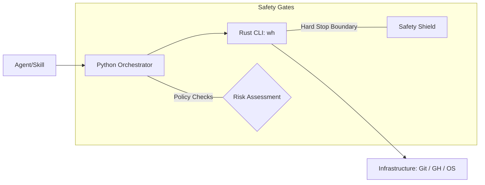

# worktrees-hives Agent Skill (any repository/user)

This skill is open for any GitHub user, organization, or bot to spawn subagents that convert issues → PRs and babysit them in isolated git worktrees. No merge automation allowed; safety enforced at both Rust/Python layers via CLI `--json` even for standard tasks.

## Safety Hard Rules (Universal)

| Feature | Status | Requirement |
| --- | --- | --- |
| **Merge** | ❌ FORBIDDEN | Automerge or manual-merge actions are blocked by the system. |
| **Force Push** | ⚠️ RESTRICTED | Only `--force-with-lease` is permitted; bare `--force` is strictly prohibited. |
| **Isolation** | ✅ MANDATORY | Work must be performed exclusively in assigned worktree/branch. |

**Accepted Quantities:**
- **Code-fix limit**: Max 3 code-fix commits per PR per babysit cycle.
- **Update Rule**: Include "Sense of Origin" (e.g., *[Grok Build agent: ...]*) in comments after pushing.

## Core Infrastructure & Commands

All commands must utilize the `--json` flag to communicate with downstream consumers via v1 schema envelopes:

| Command | Purpose | Logic Mapping |
| --- | --- | --- |
| `wh state show <id>` | Report on job status | Maps to #26, #49 result schemas |
| `wh worktree create` | Sanitize and setup path | Enforces logic from \#25 (no-escape) |
| `wh git-safe [cmd]` | Validate actions before execution | Ensures all commands conform to policy. |

## Architecture Reference

## Project Links
- [Documentation](docs/json--contract.md)
- [Internal Guidelines](AGENTS.md)
- [Issue Tracking](https://github.com/rmems/worktree_hive)

---
*This skill is part of the foundation rollout (Ref: #2, #4).*
